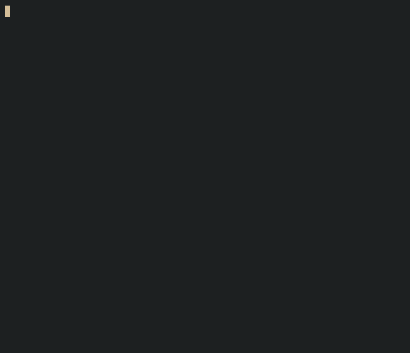

# gbx — Git Branch Explorer

A terminal UI for exploring git branches and commits. Navigate branches, inspect commit history, and switch branches without leaving your terminal.


## Preview



## Features

* Browse local git branches in a fast terminal UI
* View commit history for the selected branch
* Switch branches directly from the interface
* Keyboard-driven navigation
* Lightweight and dependency-free runtime
* Built with Bubble Tea v2

## Installation

### One-liner (Linux / macOS)

```bash
curl -fsSL https://raw.githubusercontent.com/Pixie2468/git-branch-explorer/main/install.sh | bash
```

Install to a custom directory:

```bash
curl -fsSL https://raw.githubusercontent.com/Pixie2468/git-branch-explorer/main/install.sh | bash -s -- --dir ~/.local/bin
```

### Go Install

```bash
go install github.com/Pixie2468/git-branch-explorer@latest
```

### From Source

```bash
git clone https://github.com/Pixie2468/git-branch-explorer.git
cd git-branch-explorer
make build
./gbx run
```

## Usage

```bash
# Run in current directory
gbx run

# Run in a specific repository
gbx run --dir /path/to/repo

# Set a timeout for git commands
gbx run --timeout 5s

# Show version
gbx version
```

## Keybindings

| Key               | Action                        |
| ----------------- | ----------------------------- |
| `Tab` / `→`       | Switch focus to commits pane  |
| `Shift+Tab` / `←` | Switch focus to branches pane |
| `↑` / `k`         | Move cursor up                |
| `↓` / `j`         | Move cursor down              |
| `Enter`           | Switch to selected branch     |
| `q` / `Ctrl+C`    | Quit                          |

## Build

```bash
make build         # Build for current platform
make dist          # Cross-compile all platforms
make checksums     # Generate SHA256 checksums
make test          # Run tests
make vet           # Run go vet
make clean         # Remove build artifacts
```

## Release

Releases are automated through GitHub Actions.

Tag a commit and push:

```bash
git tag v0.1.0
git push origin v0.1.0
```

This triggers the release workflow, which:

* Cross-compiles supported platforms
* Generates SHA256 checksums
* Publishes a GitHub Release with all binaries

## License

This project is licensed under the MIT License. See the [LICENSE](LICENSE) file for details.
